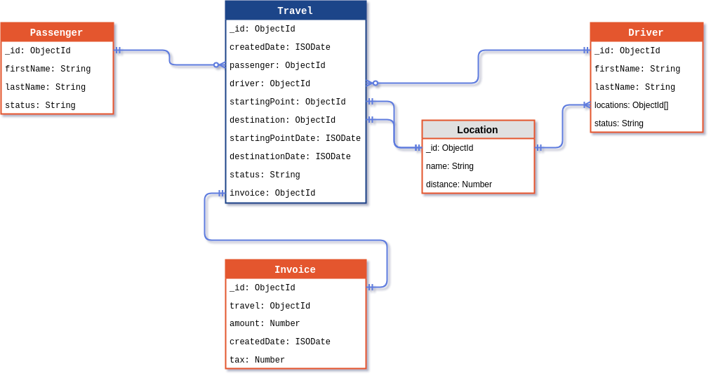

# WEB APPLICATION - TAXI TEST

## REQUIREMENTS

1. Drivers

	A. Get all drivers list => `GET (/api/drivers)`

	B. Get all available drivers list => `GET (/api/drivers?status=available)`

	C. Get all available drivers list within 3km ratio => `GET (/api/drivers?status=available&ratio=3km)`

	D. Get a specific driver through his ID => `GET (/api/drivers/:id)`

2. Travels

	A. Create a new travel request with a assigned driver to passenger => `POST (/api/travels)`

	B. Complete a travel => `PATCH (/api/travels/:id)`

	C. Get all active travels list => `GET (/api/travels?status=active)`

	D. Get the 3 closest drivers to passenger list => `GET (/api/travels/:idTravel/drivers)`

3. Passengers

	A. Get all passengers list => `GET (/api/passengers)`

	B. Get a specific passenger through his ID => `GET (/api/passengers/:id)`

	C. Request a new travel => `PUT (/api/passengers/:idPassenger/travel)`

	E. Set Driver to Requested Travel => `PATCH (/api/passengers/:idPassenger/travels/:idTravel/driver/:idDriver)`

## OPTIONS

* Clean project

```bash
[~]$ ./mvnw clean install
```

* Test project

```bash
[~]$ ./mvnw test
```

* Run project

```bash
[~]$ ./mvnw spring-boot:run
```

* Build project

```bash
[~]$ ./mvnw package
```

## EER Diagram


